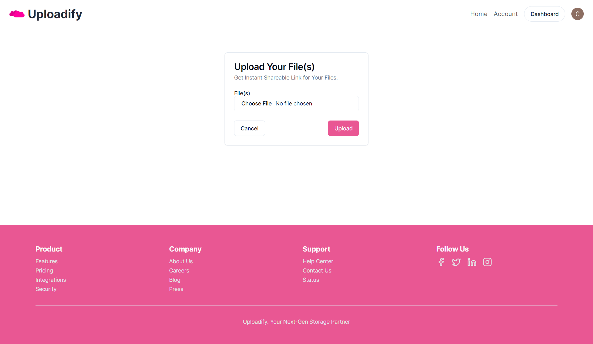
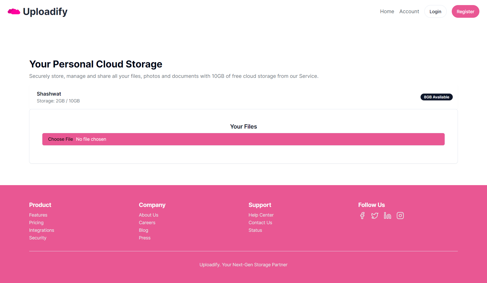
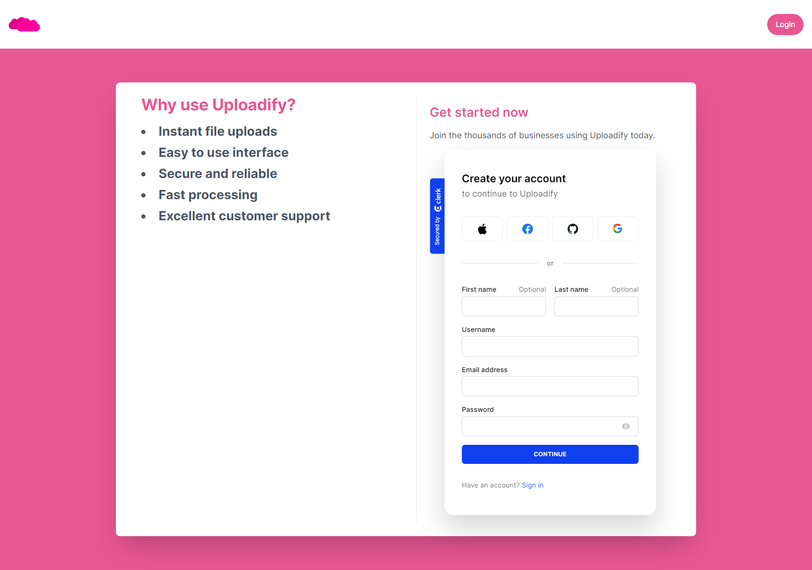

# **Uploadify README**

## **Project Overview**

Uploadify is a cloud-based file storage and management system built using NextJS, TailwindCSS, and AWS services. The project utilizes Clerk Authentication for user authentication and allows users to sign up and login using GitHub, Google, Apple, and Facebook. Users can upload files to AWS S3 and track their total usage of drive quota.

## **Features**

- User authentication using Clerk Authentication
- Support for multiple authentication providers (GitHub, Google, Apple, Facebook)
- File upload and storage using AWS S3
- Quota tracking for users
- Responsive design using TailwindCSS

## **Screenshots**

### File Upload Page



### Your Drive Page



### Sign Up Page



## **How to Deploy Guide**

### Prerequisites

- AWS account with S3 bucket created
- Clerk Authentication account with API key and secret
- Vercel account with project created

### Deployment Steps

1. Clone the repository: `git clone https://github.com/your-username/uploadify.git`
2. Install dependencies: `npm install`
3. Create a new file named `.env` with the following content:

```env
NEXT_PUBLIC_CLERK_PUBLISHABLE_KEY=your-clerk-publishable-key
CLERK_SECRET_KEY=your-clerk-secret-key
AWS_ACCESS_KEY_ID=your-aws-access-key-id
AWS_SECRET_ACCESS_KEY=your-aws-secret-access-key
AWS_REGION=your-aws-region
AWS_BUCKET_NAME=your-aws-bucket-name
NEXT_PUBLIC_CLERK_SIGN_IN_URL=your-clerk-sign-in-url
NEXT_PUBLIC_CLERK_SIGN_OUT_URL=your-clerk-sign-out-url
NEXT_PUBLIC_CLERK_AFTER_SIGN_IN_URL=your-clerk-after-sign-in-url
NEXT_PUBLIC_CLERK_AFTER_SIGN_OUT_URL=your-clerk-after-sign-out-url
MONGODB_URI=your-mongodb-uri
```

4. Update the `next.config.js` file with your Vercel project ID and API token:

```js
module.exports = {
  //...
  vercel: {
    projectId: "your-vercel-project-id",
    apiToken: "your-vercel-api-token",
  },
};
```

5. Deploy the application to Vercel: `npm run deploy`

## **Instructions on Contributing**

### Getting Started

- Fork the repository: `git fork https://github.com/your-username/uploadify.git`
- Create a new branch for your feature or bug fix: `git checkout -b my-feature`

### Making Changes

- Make your changes to the codebase
- Commit your changes with a descriptive commit message: `git commit -m "Added new feature"`
- Push your changes to your forked repository: `git push origin my-feature`

### Creating a Pull Request

- Create a pull request to merge your changes into the main branch
- Ensure that your changes are thoroughly tested and reviewed by the project maintainers

## **Licence**

Uploadify is licensed under the MIT License. See the [LICENSE](LICENSE) file for more information.

## **Contact**

If you have any questions or issues with the project, please don't hesitate to reach out to the project maintainers at [shashwatshikharsingh](github.com/shashwatshikharsingh).
